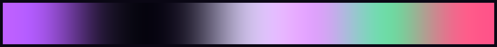
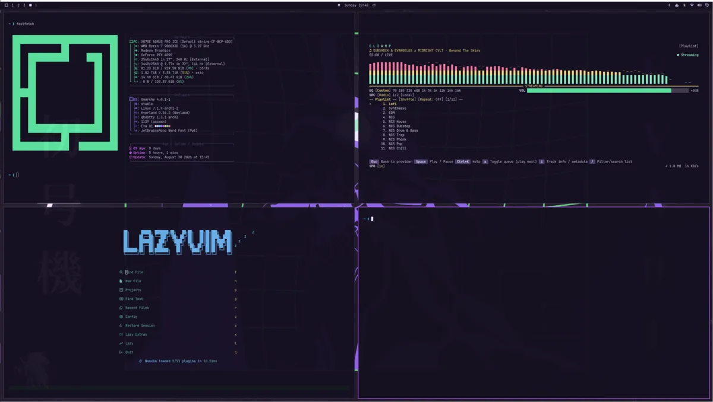

# EVA-01

A [Neon Genesis Evangelion](https://en.wikipedia.org/wiki/Neon_Genesis_Evangelion)-inspired
theme for [Omarchy](https://omarchy.org/). Neon violet on deep purple-black —
high-tech, but polished. The flagship wallpaper is EVA-01 test type itself,
lifting off against a green grid.





## Palette

| Role             | Hex       |
|------------------|-----------|
| Accent           | `#b45cff` |
| Background       | `#151021` |
| Dark background  | `#0f0b1a` |
| Foreground       | `#d4c8f0` |
| Bright magenta   | `#e39bff` |
| Neon green       | `#5ee6a0` |
| Neon red         | `#ff5c8a` |

## Install

From a git URL:

```bash
omarchy theme install https://github.com/ql1max/omarchy-eva-01
omarchy theme set eva-01
```

Or manually:

```bash
git clone https://github.com/ql1max/omarchy-eva-01 ~/.config/omarchy/themes/eva-01
omarchy theme set eva-01
```

## What's inside

- `colors.toml` — the palette; every themed app is generated from this
- `backgrounds/`:
  - **01-eva01** — EVA-01 against a neon grid
    ([wallhaven 7286p3](https://wallhaven.cc/w/7286p3), resized to 2560×1440)
  - **1-magi** — the three Magi supercomputers as light beams (original, SVG source included)
  - **2-atfield** — an AT Field hexagonal lattice (original, SVG source included)
  - **3-lcl** — the LCL sea under a fading glow (original, SVG source included)
  - **4-descent** — a shaft of light descending into haze (original, SVG source included)
  - **5-sanctuary** — an AT Field, dreamt: blurred hexes and bokeh glow (original, SVG source included)
- `unlock.png` — dimmed lock-screen wallpaper
- `hyprland.lua` — sharp neon violet borders, no glow/shadow
- `shell.toml` — bar/launcher/notifications chrome; neon green second accent on
  selections and highlights, purple everywhere else
- `neovim.lua` — [nightly.nvim](https://github.com/Alexis12119/nightly.nvim) (neon purple)
- `vscode.json` — [Eva Theme](https://marketplace.visualstudio.com/items?itemName=fisheva.EVA-Theme)
- `icons.theme` — Yaru Purple Dark
- `keyboard.rgb` — keyboard backlight `#b45cff`
- `shell.lock.toml` — lock screen colors

## Submitting to omarchy.org/themes

Community themes are listed at [omarchy.org/themes](https://omarchy.org/themes/).
A PR there needs two things:

1. `assets/themes/eva-01.webp` — a 16:9 screenshot of a **real** session
   (terminal + editor visible, this theme's wallpaper, no cursor/notifications):

   ```bash
   magick preview.png -strip -resize '1200>' -quality 80 eva-01.webp
   ```

2. A `<figure>` entry in `themes/index.html`, alphabetically ordered.

Note: `01-eva01.png` is fan artwork sourced from wallhaven. If the original
artist can be identified, credit them in the PR description.

## License

MIT
